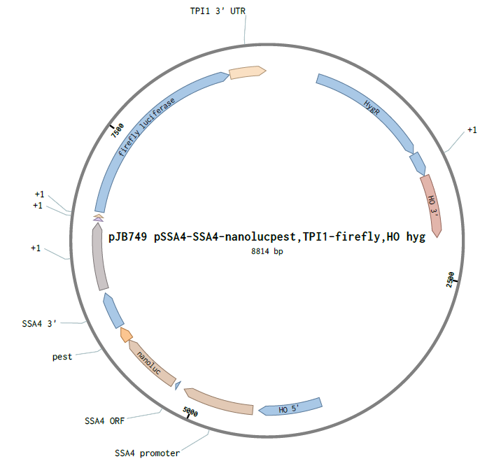

This protocol uses a nanoluciferase-PEST reporter to measure translation rate in the budding yeast *S. cerevisiae*.
The reporter design is based on that of Masser et al. Yeast 2016 May; 33(5): 191-200 (https://dx.doi.org/10.1002%2Fyea.3155).

# Protocol #

## Reagents

### Yeast Strain
- BY4742 + pJB749 (integrated at HO locus, selected with hygromycin)

### Wet reagents

- yeast growth media (SC or YP plus sugar if required)
- Promega Nano-Glo (PRN1130)

### Consumables

- 96-well 2mL deep well plate (Dot cat. no 229575)
- 96-well u-bottom microtiter plate (Thermo 1424571)
- 96-well PCR plate (Thermo AB-0600)
- 8-channel pipette (100uL or 200uL)
- 8-channel pipette (20uL) (Rainin P20 LTS)
- Breathe-easy sealing film (Sigma Z380059-1PAK)
- 384-well white plates (Corning CLS3574-50EA)

### Instruments

- Multimodal microplate reader (Tecan Spark 20M)
- 96-well thermocycler
- 30 &deg;C shaking incubator

## Procedure

1. Grow cells
	- 3 days prior
		- streak strain from glycerol stock onto YPD plate, incubate at 30 &deg;C
	- 2 days prior
		- pick one colony and grow in liquid YPD overnight with shaking at 30 &deg;C  
		_culture can be stored at 4 &deg;C_
	- 1 day prior
		- assuming a doubling time of 85 minutes and a lag phase of 170 minutes, dilute yeast into 8 mL of fresh YPD such that it will grow to an OD600 < 0.2 the next day
		- grow at 30 &deg;C with shaking
	- Day of morning
		- dilute to OD600 < 0.05 (such that experiment will start at OD600 = 0.1)

2. Prepare to measure translation
	- Calculate amount of Nano-Glo reagent required (will need 10 &mu;L per measurement)
	- Prepare 0.5x Nano-Glo reagent by first mixing lysis buffer with 1:50 reagent, then diluting 1:1 with H2O  
	  _diluting 0.5x is not necessary, but saves money and seems to work fine_  
  	- aliquot 10 &mu;L reagent into 96-well PCR plates for later measurements
	- Calibrate the OD readings: Need to measure blank OD600 and calculate the pathlength of the measurement
  	- Use multichannel to transfer 3x blank media and 3x yeast growth with known OD to U-bottom 96-well microplate
  	- Read using JB_210712_A600_whole.mth on sparkcontrol (not magellan)
    	- method first shakes for 5 seconds (linear, amplitude=4)
    	- then reads every well at 600 nm with flashes=30 and settle time = 500 ms  
  	  	**the settle time is important to get accurate readings**
  	- Using beer-lambert law (A = _&epsilon;lc_), calculate the pathlength (I got around 0.5 cm) and note the mean blank reading

3. Treat cells
   - Treatment will vary by experiment. In my experiments, I have been measuring the translation of two reporters both before and after heatshock.
   - Transfer 0.25 mL yeast to 2 mL deep well plate
     - To account for variability in the luminescence readings, I always normalize my readings to a control strain. I also try to mix the order of my samples and do measurements in triplicate.
        - For instance, given reporter A and reporter B, and varying concentrations of drug I would arrange my columns like so
			|  | 1 | 2 | 3 | 4 | 5 | 6 | 7 | 8 |
			|---:| --- |  --- | --- | --- | --- | --- | --- | -- |
			| **A** | A | B | A | B | A | B | A | B |
			| **B** | B | A | B | A | B | A | B | A |
			| **C** | A | B | A | B | A | B | A | B |

			 |  | 1 | 2 | 3 | 4 | 5 | 6 | 7 | 8 |
		 	 | ---: | --- |  --- | --- | --- | --- | --- | --- | -- |
		 	 | **A** | - | - | +10 | +10 | +20 | +20 | +40 | +40 |
		 	 | **B** | - | - | +10 | +10 | +20 | +20 | +40 | +40 |
		 	 | **C** | - | - | +10 | +10 | +20 | +20 | +40 | +40 |

   - Cover 2mL deep well block in breath-easy film, tape to shaking platform and shake at 30 &deg;C

4. Measure OD and luminescence (eventually want to calculate lum_per_OD to normalize for varying cell counts between samples)
   - Using multi-channel, transfer 150 &mu;L to 96-well U bottom microplate, read OD600 as above
   - transfer 10 &mu;L of culture to 10 &mu;L Nano-Glo reagent in PCR plates (make sure to pipette up and down before transferring to mix any cells that have settled, then mix again 3x after transferring)
   - Transfer 15 &mu;L to 384-well white plate  
	 _recommended to leave a well of blank between every well to prevent bleedthrough. Remaining wells can be filled in after a few days_
   - Spin for 30 seconds in plate centrifuge
   - Incubate for 4 minutes before reading
   - Measure with e.g. JB_210712_Lum_A1toB12.mth (loop of 5 measurements, integration time = 250 ms, take average of measurements during analysis)

5. Heat shock and measure luminescence again
   - transfer 20 &mu;L of culture to 96-well PCR plate
   - Treat at 42 &deg;C using thermocycler
   - Re-read luminescence as above; I re-use the OD reading from above for normalization (assumes that during treatment the number of cells has changed a small amount)
